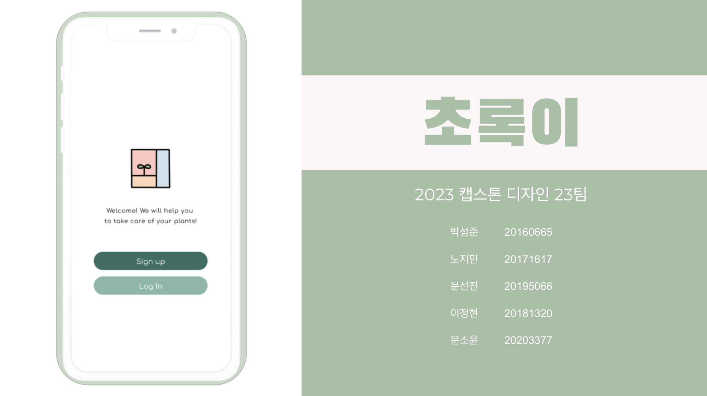

# 🌿초록이🌿

<h1>프로젝트 소개</h1>

<h4>최근 식물을 활용한 인테리어에 대한 관심이 커지면서 너도나도 식물을 집에 들이고 있다.
   
하지만 호기롭게 집에 들인 식물들은 생각보다 섬세한 관리를 요하고, 초보 집사들은 실수를 저지르기 쉽다.
   
또한 배테랑 집사들도 여행 혹은 잦은 출장으로 집을 비워야 할 때에 혼자 남겨질 식물때문에 걱정이 크다.
 
이러한 문제를 해결하기 위해 부재 시에도 식물의 특성에 맞는 적정 성장 환경을 유지하고, 실시간으로 식물 상태를 확인 할 수 있는 서비스를 만들었다.
</h3>

<h1>Abstract</h1>
<h4>With the rising interest in plant-based interior design, more and more people are bringing plants into their homes.
 
However, these plants, which were eagerly introduced, often require more delicate care than expected, making it easy for novice plant caretakers to make mistakes.
 
Even veteran caretakers worry about leaving their plants alone when they have to leave home for trips or frequent business travel.
 
To address these issues, we've created a service that maintains an optimal growth environment suited to the plant's characteristics even in the owner's absence, 
and allows real-time checking of the plant's condition.
</h3>

<h1>주요 기능</h1>

<ul>
  <li><strong>식물 케어 서비스</strong>
    <ul>
      <li><strong>적정 환경 유지</strong> 관리 중인 식물의 특성에 알맞은 온도, 습도, 일조량을 유지하여 식물의 성장을 도와줍니다.</li>
      <li><strong>원격 제어</strong> 직접 식물의 환경을 제어하지 않아도 어디서든지 웹/모바일로 온습도를 조절할 수 있도록 도와줍니다.</li>
      <li><strong>이상탐지 알림</strong> 정해진 시간마다 식물의 이상을 탐지하여 이상이 탐지될시 사용자에게 알람을 제공합니다.</li>
    </ul>
  </li>
  <li><strong>관리현황 조회</strong>
    <ul>
      <li><strong>실시간 모니터링</strong> 실시간 모니터링 기능을 통해 부스 내부의 환경을 실시간으로 확인할 수 있어, 필요에 따라 즉각적인 대처가 가능합니다.</li>
      <li><strong>식물 성장 일지</strong> 매일매일 식물의 성장과정을 확인하고, 일지를 작성할 수 있어 식물의 성장 상태를 쉽게 파악할 수 있습니다.</li>
    </ul>
  </li>
</ul>

<h1>부스사진<h1/>
 

<h1>시연영상<h1/>
 
<a href ="https://www.youtube.com/embed/npBVgDlOBvg">
<a/>

---

<h2>👥 팀 소개</h2>

<h3>🎨 FrontEnd</h3>

<table>
  <tr>
    <th>FrontEnd</th>
    <th>FrontEnd</th>
  </tr>
  <tr>
    <td>문 선진</td>
    <td>박 성준</td>
  </tr>
  <tr>
    <td>****5066</td>
    <td>****5066</td>
  </tr>
  <tr>
    <td></td>
    <td></td>
  </tr>
</table>

🛠️ <strong>Tools and Technologies:</strong>

<h3>🖥️ BackEnd</h3>

<table>
  <tr>
    <th>BackEnd</th>
  </tr>
  <tr>
    <td>이 정현</td>
  </tr>
  <tr>
    <td>****1320</td>
  </tr>
  <tr>
    <td></td>
  </tr>
</table>

🛠️ <strong>Tools and Technologies:</strong>

<h3>⚙️ Embedded System</h3>

<table>
  <tr>
    <th>Embedded System</th>
  </tr>
  <tr>
    <td>문 소윤</td>
  </tr>
  <tr>
    <td>****3377</td>
  </tr>
  <tr>
    <td></td>
  </tr>
</table>

🛠️ <strong>Tools and Technologies:</strong>

 

<h3>🧠 AI</h3>

<table>
  <tr>
    <th>AI</th>
  </tr>
  <tr>
    <td>노 지민</td>
  </tr>
  <tr>
    <td>****1617</td>
  </tr>
  <tr>
    <td></td>
  </tr>
</table>

🛠️ <strong>Tools and Technologies:</strong>

<h3>🤝 Collaboration</h3>

